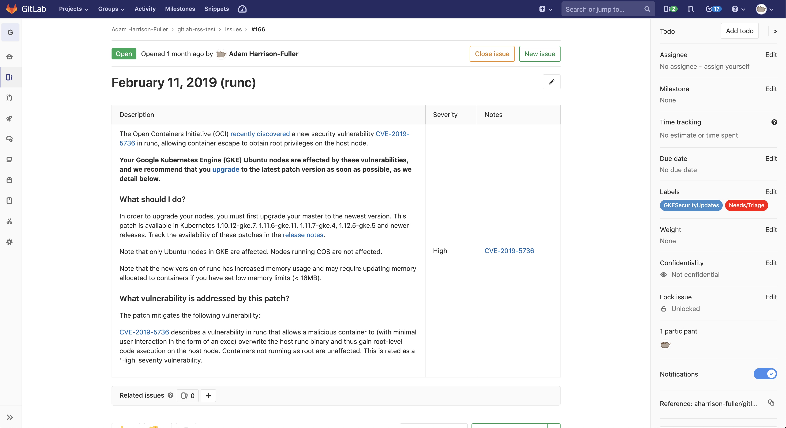

# Gitlab RSS Sync


Create Gitlab issues from RSS Feeds with optional labelling.  Created to monitor RSS feeds and bring posts to
our attention (Security Releases, Product Updates etc)

## Avoiding Duplication
We try to be as clever as is reasonably possible in terms of not duplicating RSS feed items into Gitlab.
A Redis database is used to store the GUID/FeedID combination which is checked when assessing articles for synchronisation.
In addition we also add the RSS feed's item GUID at the bottom of the issue description.  Before synchronising an RSS item
we run an issue search in the associated project, if we dont find the GUID in any issue we assume its not already been created.
This helps to guard against scenarios where you lose the Redis database and dont want RSS items reduplicating into Gitlab.
If found in Gitlab it is marked as synchronised in the Redis database as well as printing an link to the existing issue(s) to stdout.

## Limiting what is initially synced.
Each feed entry in the config file can have an "added_since" property set.  This is used to only sync RSS items that have a
Published/Updated date greater than the provided value.  This can be useful on RSS feeds where you dont want to import historic items,
just new posts going forward.

## Config file

The config file **MUST** be named config.yaml, an example one is provided [here](config.yaml.example).  Below is a brief
 description of its contents.

```yaml
interval: 300
feeds:
  - id: test 
    feed_url: http://example.com/rss.xml
    name: Test Feed
    gitlab_project_id: 12345
    added_since: "2019-03-27T15:00:00Z"
    labels:
      - TestLabel
   - id: feed2
     ...
```
### Global
| Attribute | Type | Required | Description                                 |
|-----------|------|----------|---------------------------------------------|
| interval  | int  | yes      | The interval in seconds between feed checks |

### Feeds
| Attribute         | Type   | Required | Default | Description                                                                                              |
|-------------------|--------|----------|---------|----------------------------------------------------------------------------------------------------------|
| id                | string | yes      | n/a     | A feed ID that is used internally for duplicate detection.                                               |
| feed_url          | string | yes      | n/a     | The URL of the feed                                                                                      |
| name              | string | yes      | n/a     | A User friendly display name.                                                                            |
| gitlab_project_id | int    | yes      | n/a     | The Gitlab project ID to create issues under.                                                            |
| added_since       | string | no       | null    | For longer RSS feeds specify a ISO 8601 DateTime to exclude items published/updated earlier than this    |
| labels            | Array  | no       | []      | A list of labels to add to created Issues                                                                |
| retroactive       | bool   | no       | false   | If true the issue in Gitlab will have the same creation time as the RSS feed items updates/published time|


## Docker
A Docker image is made available on [DockerHub](https://hub.docker.com/r/adamhf/gitlabrsssync)

### Required Environment Variables
* GITLAB_API_TOKEN - Gitlab personal access token that will be used to create Issues NOTE: You must have access to create
issues in the projects you specify in the config file.
* CONFIG_DIR - The directory the application should look for config.yaml in.
* REDIS_URL - The URL of the Redis host e.g. `redis:6379`
* REDIS_PASSWORD - Password for Redis, if an empty password is required set to `REDIS_PASSWORD=`
* USE_SENTINEL - If set the REDIS_URL will be treated as a sentinel and the current master acquired via the sentinel.

### Run it

#### Via Docker
```bash
docker run -e GITLAB_API_TOKEN=<INSERT_TOKEN> -e CONFIG_DIR=/app -v REDIS_URL=<REDIS_URL> -v REDIS_PASSWORD=<REDIS_PASSWORD> -v ${PWD}:/config adamhf/rss-sync:latest
```

#### Via docker-compose
```bash
docker-compose up
```

## Prometheus Metrics
Two metrics (above and beyond what are exposed by the Go Prometheus library) are exposed on :8080/metrics
* last_run_time - The time of the last feed checks, useful for creating alerts to check for successful runs.
* issues_created - The total number of issues created in Gitlab, useful to check for runaways.

## Healthz Endpoint
A /healthz endpoint is exposed on :8081/healthz which will fail if it is unable to connect to Redis.

## Example Issues
### GKE Release Notes
Feed URL: https://cloud.google.com/feeds/kubernetes-engine-release-notes.xml

### GKE Security Updates
Feed URL: https://cloud.google.com/feeds/kubernetes-engine-security-bulletins.xml

